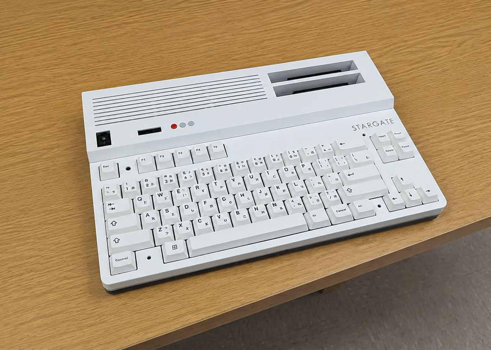

# Stargate MSX Compatible Computer

Stargate is an MSX compatible computer built using parts that are still available today.

Many original MSX parts are becoming harder to find, more expensive, or counterfeit. Stargate uses a hybrid approach where common parts remain original while rare or unreliable components are replaced with modern alternatives such as the Tang Nano 20K.

The board is a dual layer PCB using 74-series logic, an 8255 PPI, and a real PSG chip. Video is handled by a Tang Nano 20K running a V9958 compatible core. The Z80 is also implemented inside the FPGA.

If you have a soldering iron and some patience, you can probably put it together.

The machine is built around the **[Goauld SD project](https://github.com/jabadiagm/MSXgoauldSD_tn20k)** by Javier Abadia.

## Goauld SD project

https://github.com/jabadiagm/MSXgoauldSD_tn20k

## Goauld Core specs

- Z80
- V9958 compatible video with HDMI output
- MSX2+ BIOS
- SD card support with Nextor 2.1
- 4 MB mapper
- 2 MB MegaRAM SCC
- RTC
- PSG
- OPLL
- Kanji Level 1 and 2
- Wi-Fi support using ESP

## Stargate features

- Mechanical keyboard
- OLED display
- Overclocking up to 14 MHz (WIP)
- RGB LED effects
- On-board audio
- Audio output
- Reset button
- USB-C and barrel jack for power
- Two joystick ports
- Two cartridge slots
- USB network printing
- IoT Tasmota integration
- IoT TP-Link HS1xx outlet control

## WIP Daughter Board (Internal/External)

> [!NOTE]
> Additional features are provided through an optional daughter board.

**Ready:**

- USB printer support
- Ethernet connection
- Bluetooth joystick firmware
- RGB Gaming mode (LEDs react to RGB modded games)

**WIP:**

- Slot 2 expansion with custom cartridge
- USB flash drive support
- USB floppy support
- Fast Wi-Fi
- Bluetooth joystick software (extra buttons mapped to keyboard keys)

> [!NOTE]
> Stargate can be assembled without the extra features as a standard MSX compatible computer.

## GitHub

https://github.com/leomanes/stargate

> [!IMPORTANT]
> Project files will be made available when time permits.

## Open Source projects

- Javier Abadia, MSXgoauldSD_tn20k project — https://github.com/jabadiagm
- NataliaPC, MSXgoauld Settings Menu — https://github.com/nataliapc
- Skoti, JFF Computer — https://github.com/konkotgit
- Sergey Kiselev, Omega Keyboard — https://github.com/skiselev
- Oduvaldo (ducasp), UNAPI Driver — https://github.com/ducasp

## Other references

HARA, konamiman, antoniosi
