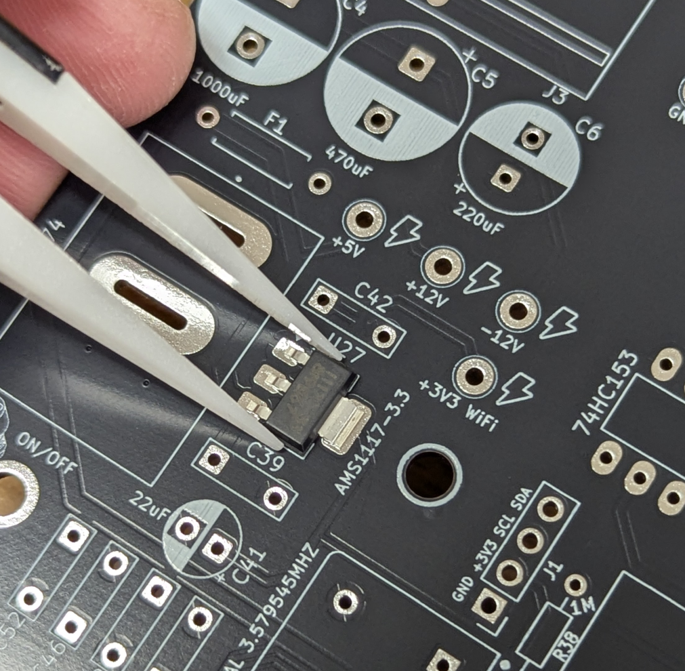
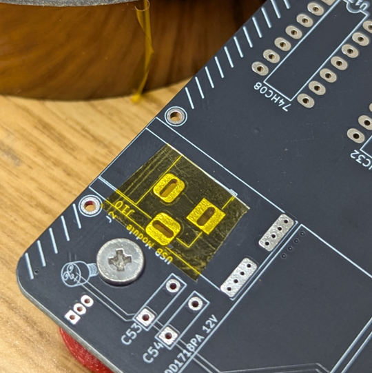
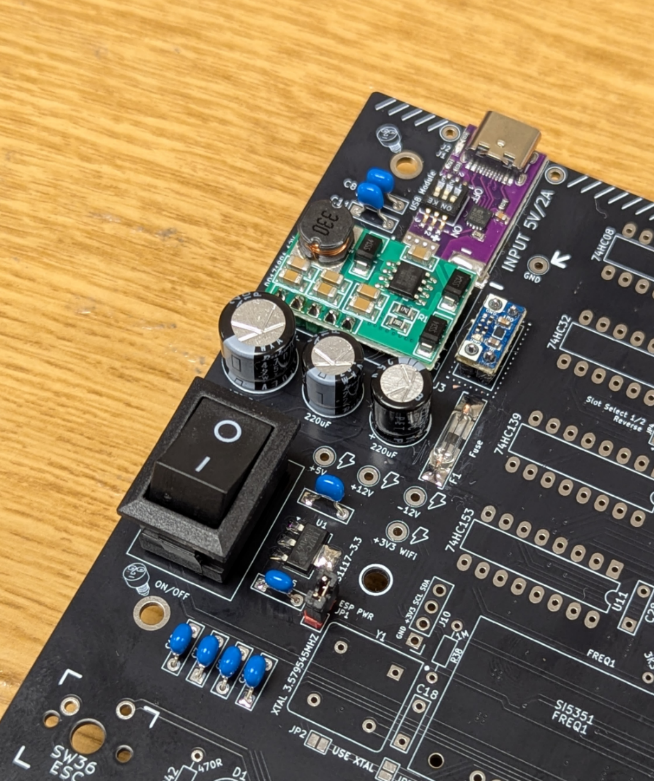
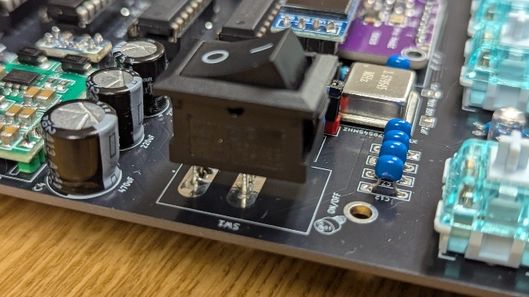
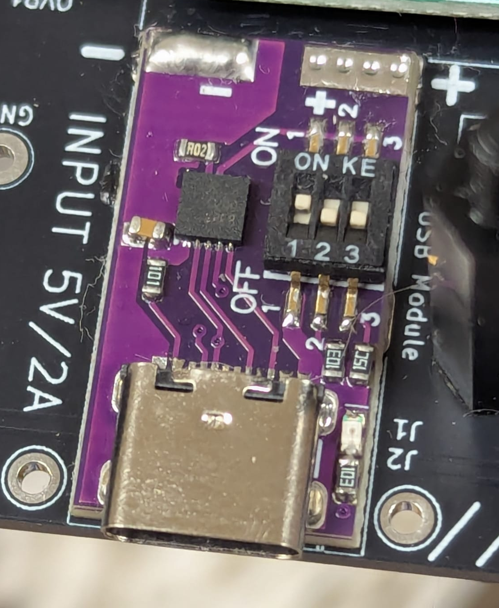
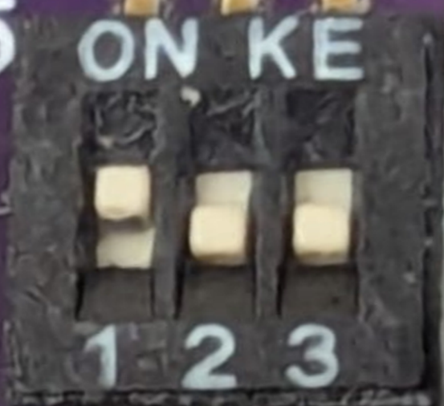
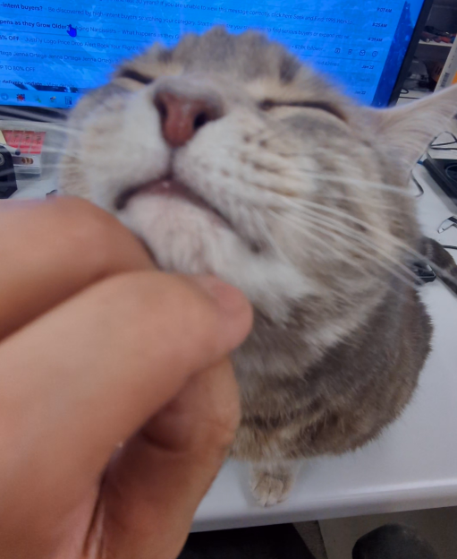
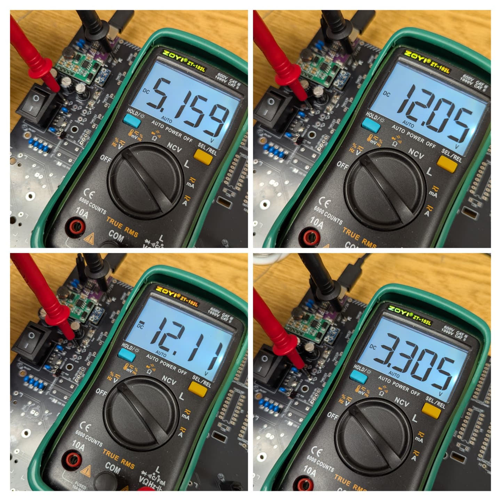
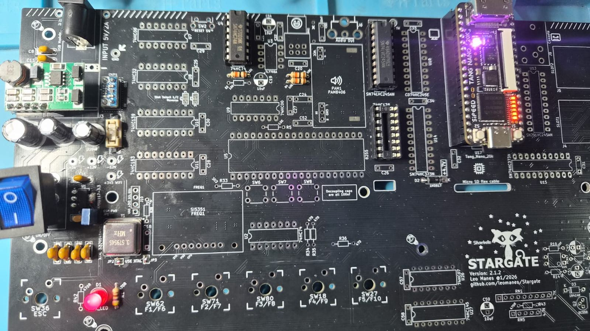
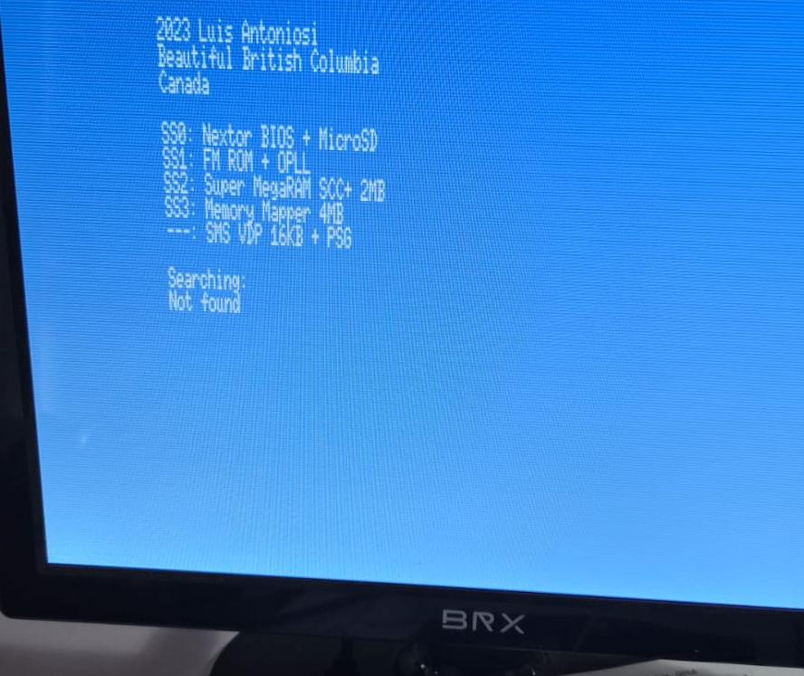

<HTML>
<BODY>

<strong>THIS IS A TEMPORARY ASSEMBLY GUIDE. EXPECT IT TO CHANGE WITHOUT WARNINGS.</strong>

&nbsp;

<h2><strong>STARGATE BASIC VERSION:</strong></h2>

The basic version does not have RGB leds, overclock capabilities or the oled screen.

Wi-Fi is optional.

&nbsp;

<strong>STEP 1: POWER SUPPLY</strong>

If you are going to assemble the basic version <u>without Wi-Fi</u>, you can skip U1, C16, C15, and the jumper JP1.

If you are going to power the machine using an USB-C charger (recommended), add a piece of tape to cover the unused barrel jack pads.

Also, make sure your charger/adapter can supply at least 10W (2A) but 15W (3A) is encouraged.

Solder the PSU parts.

<ul>
<li>U1 &ndash; AMS-1117-3.3</li>
<li>J1 OR J2 - (barrel jack or USB Decoy);</li>
<li>J3 - DC-DC converter (use straight pin headers);</li>
<li>OVP1 &ndash; Over Voltage Protection;</li>
<li>F1 &ndash; Fuse 1.5A;</li>
<li>D1 &ndash; Power Led ,RED 5mm;</li>
<li>R1 &ndash; 470R;</li>
<li>D2 &ndash; Diode 1N5817;</li>
<li>JP1 &ndash; Jumper (power ESP12F);</li>
<li>SW1 - Power Switch (do not insert the switch all the way down (only the tip of the terminals should be soldered. It will need to be adjusted later);</li>
<li>C4, C5, C6, C7, C8, C9, C10, C11, C12, C15, C16 &ndash; Capacitors.</li>
</ul>

If you are <strong>not</strong> going to use carts that require +-12V you don&rsquo;t need the DC-DC converter J3 or the caps C5, C6, C8, C9, C11 and C12.

<strong>Very few carts</strong> require these voltages and with the internal micro-SD, you probably will not even need to use the slots. Most CASIO machines don&rsquo;t have these voltages.

USB Decoy configuration:

If using the Decoy USB, make sure it is configured to <strong>5V </strong>before powering up the machine:

Switches:

1 = ON

2 = OFF

3 = OFF

Once you configure it, do not touch it anymore. Cover it with a piece of electric tape if possible. <strong>An incorrect setting can damage your machine and even release the magic smoke.</strong>

&nbsp;

CRITICAL STEP

Pet your cat.

No cats? Adopt one from a shelter, they need a home. Specially the adult ones.

&nbsp;

<strong>COLD TEST 1 - PSU</strong>

Before continuing, make sure you test all the voltages using a multimeter.

Use the GND, +5V, +12V, -12V, 3.3V and 4.7V Test Points to verify if the voltages are correct. &nbsp;They are all marked on the board with a lightning bolt icon. Verify the 4.7V on D2 as well next to the Tang Nano (you should read above 4.7V).

&nbsp;

<strong>STEP 2: CLOCK + TANG</strong>

<ul>
<li>Solder the oscillator Y1;</li>
<li>Close the solder jumpers JP2 and JP3 (right below the oscillator);</li>
<li>R3, R4, R6; Resistor;</li>
<li>U16, U4 &ndash; IC/sockets;</li>
<li>U17 &ndash; Socket + Tang Nano 20K *</li>

</ul>

  * <strong>Make sure you program your Tang Nano 20K before running the &ldquo;COLD TEST 2&rdquo;. Refer to Palver&rsquo;s GitHub page:</strong>

<strong>github.com/jabadiagm/MSXgoauldSD_tn20k</strong>

&nbsp;

<strong>COLD TEST 2 &ndash; BOOT SCREEN</strong>

This test will verify if your Stargate can boot with the few basic parts.

Connect the Stargate to the HDMI monitor and run a boot test. You should boot and land on BASIC.

You should see the boot screen, but you won&rsquo;t be able to do anything else.

&nbsp;

<strong>STEP 3: GLUE LOGIC + CARTRIDGE SLOTS </strong>

Now we are going to take care of the main glue logic and install the cartridge slots. Solder all the components listed below.

<ul>
<li>C18, C19, C20, C21, C22, C23, C24, C25, C26, C27, C28, C29, C30, C31, C32, C33, C34, C35, C36 &ndash; Capacitors;</li>
<li>R2, R5 &ndash; Resistors;</li>
<li>RN1, RN2 &ndash; Resistor Networks;</li>
<li>U10, U11, U12, U13, U14, U15, U18, U3, U5, U6, U7, U8, U9 &ndash; IC/Sockets;</li>
<li>J4, J5 &ndash; Cartridge connectors;</li>
<li>SW2 &ndash; Reset microswitch.</li>
</ul>

<strong>&nbsp;</strong>

<strong>COLD TEST 3 &ndash; CART SLOT TEST</strong>

First confirm the machine is booting to BASIC like in the previous COLD TEST 2.

Next, turn the machine on with a cartridge plugged in. Use a regular ROM cart if possible. Not all cartridges are compatible with Goa&rsquo;uld so try something simples first.

Test both slots.

( * the Gradiente Expert Tang firmware will not work for the Stargate. Slot 2 will fail among other issues. You need original's Palver's firmware)

&nbsp;

<strong>STEP 4: JOYSTICK</strong>

Solder the parts listed below:

<ul>
<li>U2, U19, U20, U21, U22</li>
<li>C43 - C46</li>
<li>F2 - 0.5A</li>
<li>RN3 e RN4</li>
<li>J7, J8</li>
</ul>

&nbsp;

<strong>COLD TEST 4 &ndash; JOYSTICK</strong>

Plug a MSX compatible controller on J7.&nbsp;(***make sure it is a MSX controller or you might blow a fuse or damage your Stargate***)

Boot Stargate with a cart and test UP,DOWN,LEFT,RIGHT, TRIGGER1,TRIGGER2 on both joystick ports. Make sure the game you select can use joysticks. Sofarun is also an option for testing.

&nbsp;

<strong>STEP 5: ESP12F</strong>

Solder the parts listed below:

<ul>
<li>U24 - ESP12F</li>
<li>R37=220R for blue led | 470R for other colors) - modern led only. Avoid older used ones. They might prevent the ESP from booting.</li>
<li>R27 to R39</li>
<li>D4 - (flat side of the LED connected to the square pad)</li>
<li>C17 (laying down on the pcb)</li>
<li>SW3,SW4,SW5,SW6,SW7,SW8,SW9</li>
<li>J11</li>
<li>OLED screen (if you are not using a custom 3D case, use a header to plug the oled)</li>
</ul>

&nbsp;Now program the ESP using a UART-USB adapter with dupont leads and the ESP Tools.

<strong>&nbsp;</strong>

<strong>COLD TEST 5 &ndash; ESP12F</strong>

Unplug the UART-USB, make sure JP1 is connected and turn on Stargate.

The oled needs to display STARGATE.

&nbsp;

<strong>STEP 6: AUDIO MIXER</strong>

Solder the parts listed below:

<ul>
<li>R7-R13</li>
<li>C37-C41</li>
<li>J6</li>
<li>Q1</li>
<li>RV1 (audio feedback from the cassete and bluetooth while loading games)</li>
</ul>

&nbsp;

<strong>COLD TEST 6 &ndash; AUDIO MIXER</strong>

Verify if audio is present on the RCA jack on the back of the machine. Test with a MSX1 ROM (for PSG) cart and a MSX pico running a SCC game (for cart Audio-IN).

Make sure the option "Disable PSG:" is set to OFF on the OLED settings. 

<strong>&nbsp;</strong>

</BODY>
</HTML>
